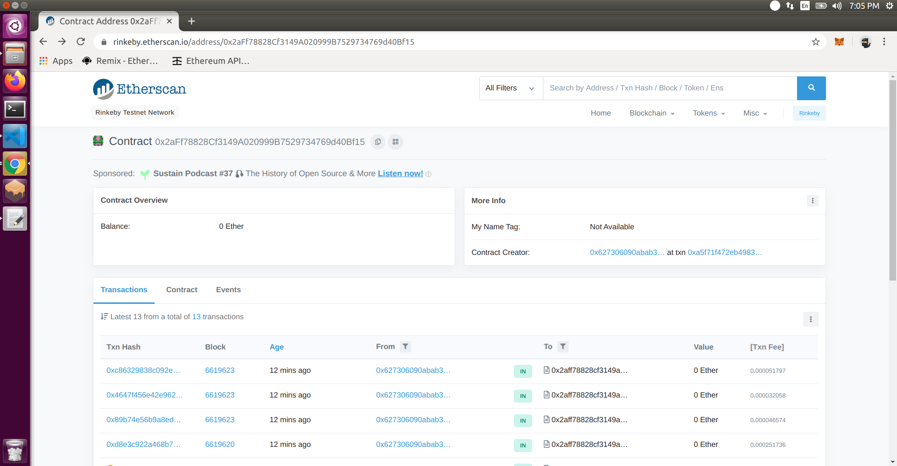
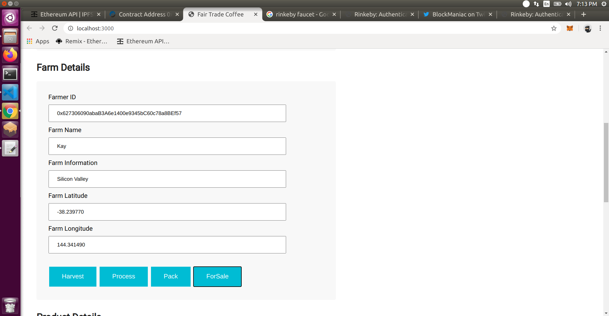
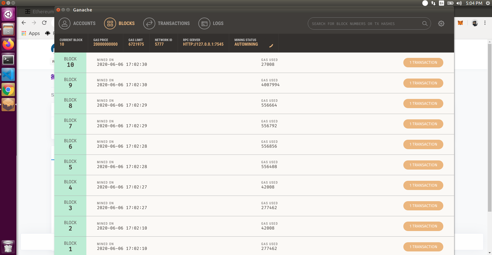
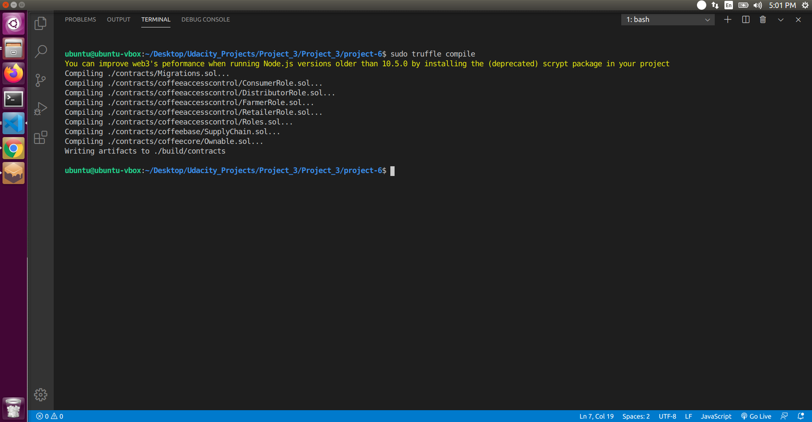
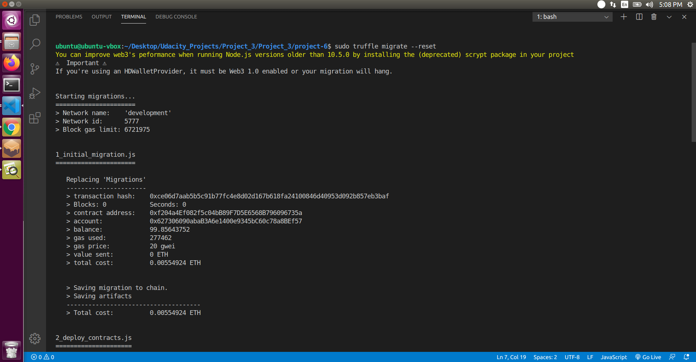
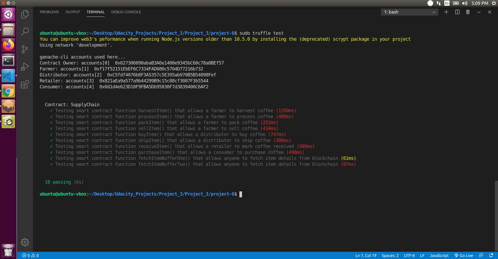
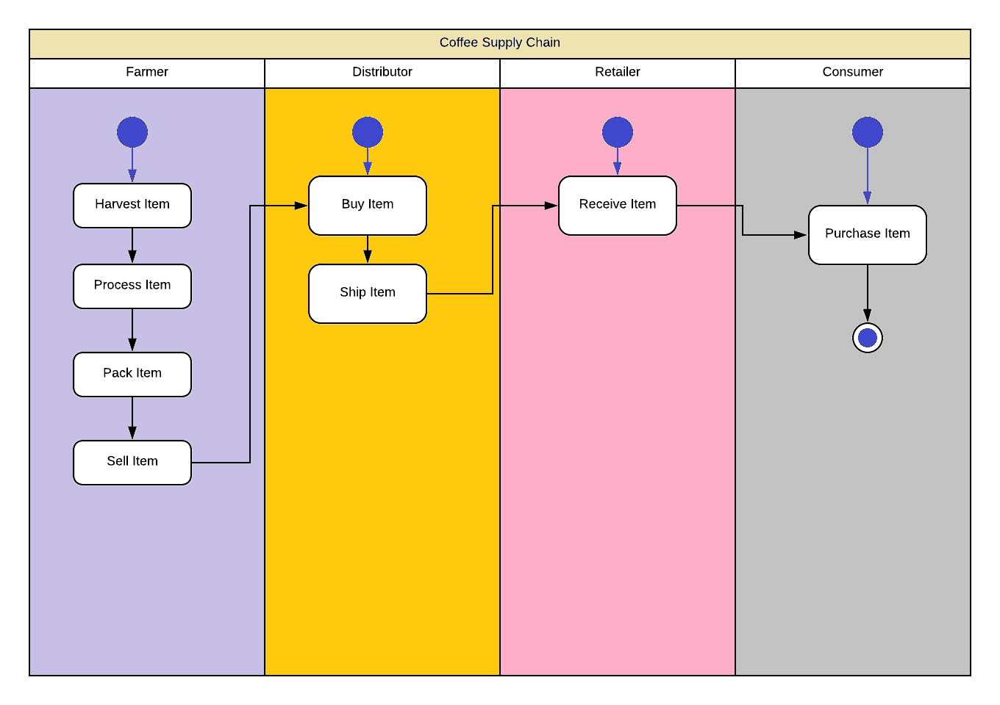
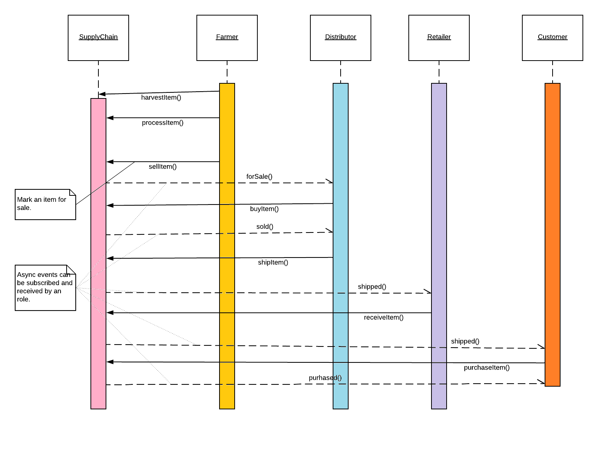
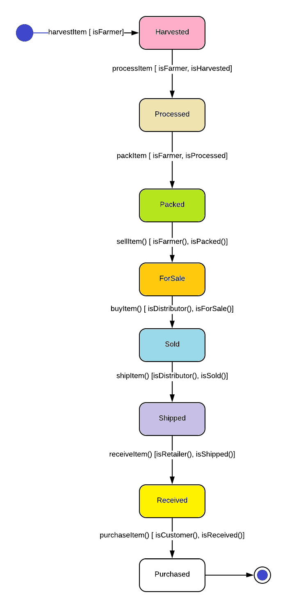
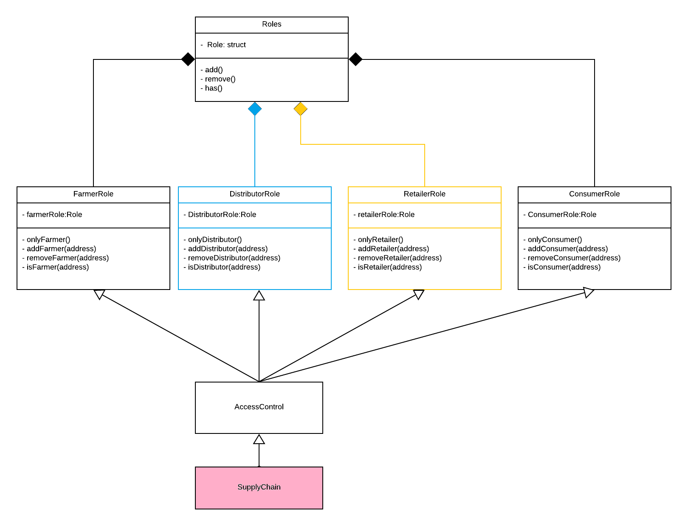

# Supply chain & data auditing

This repository containts an Ethereum DApp that demonstrates a Supply Chain flow between a Seller and Buyer. The user story is similar to any commonly used supply chain process. A Seller can add items to the inventory system stored in the blockchain. A Buyer can purchase such items from the inventory system. Additionally a Seller can mark an item as Shipped, and similarly a Buyer can mark an item as Received.

* Contract Address: 0xaC6074C48CcB0b8E94C746142d7F28C9Ac00136F


<p align="center">
<br>

</p>

<p align="center">
Farm Details
<br>

</p>


## Getting Started

These instructions will get you a copy of the project up and running on your local machine for development and testing purposes. See deployment for notes on how to deploy the project on a live system.

### Prerequisites

Please make sure you've already installed ganache-cli, Truffle and enabled MetaMask extension in your browser.

* web3: 1.2.1
* Truffle: 5.0.5
* node: 9.11.2


## Launch Ganache:

Your window should look something like this:

<p align="center">
<br>

</p>
In a terminal window, Compile smart contracts:

```
truffle compile
```

Your terminal should look something like this:

<p align="center">
<br>

</p>


This will create the smart contract artifacts in folder ```build\contracts```.

Migrate smart contracts to the locally running blockchain, ganache-gui:

```
truffle migrate
```

Your terminal should look something like this:

<p align="center">
<br>

</p>


Test smart contracts:

```
truffle test
```

All 10 tests should pass.
<p align="center">
<br>

</p>

In a separate terminal window, launch the DApp:

```
npm run dev
```

## UML Documents

<p align="center">
Activity:
<br>

</p>
<p align="center">
Sequence:
<br>

</p>
<p align="center">
State;
<br>

</p>
<p align="center">
Data:
<br>

</p>
## Built With

* [Ethereum](https://www.ethereum.org/) - Ethereum is a decentralized platform that runs smart contracts
* [Truffle Framework](http://truffleframework.com/) - Truffle is the most popular development framework for Ethereum with a mission to make your life a whole lot easier.


## Acknowledgments

* Solidity
* Ganache-cli
* Truffle

